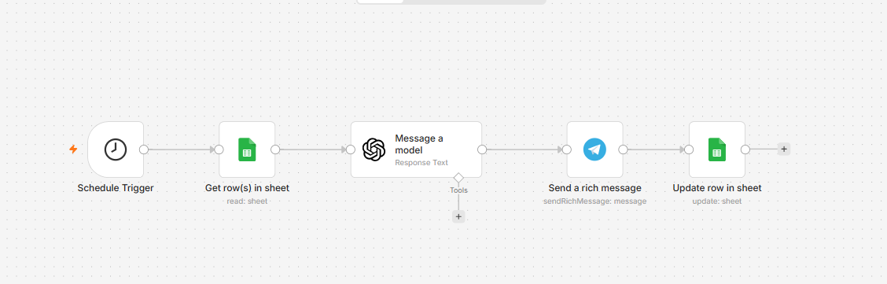

# 🤖 AI Telegram Auto-Poster Agent (n8n Workflow)

This project is an automated AI Agent built with **n8n**. It acts as an intelligent social media manager that completely automates the process of generating and publishing content to a Telegram channel.

## 🌟 How it Works
1. **Schedule Trigger:** Runs automatically twice a day (12:00 PM and 6:00 PM).
2. **Google Sheets (Database):** Reads today's topic and AI prompt from a Google Sheet.
3. **OpenAI (Brain):** Uses GPT models to generate engaging, friendly, and structured Markdown text customized for Telegram.
4. **Telegram (Action):** Posts the generated content to the target Telegram channel.
5. **Google Sheets (Update):** Marks the processed row as "Done" so it won't be posted again.

## 🛠️ Tech Stack
- **n8n** (Workflow Automation)
- **Google Sheets API**
- **OpenAI API** (GPT-4o-mini)
- **Telegram Bot API**

## 📸 Workflow Preview

## 🚀 How to Use (Install)
1. Copy the contents of `workflow.json`.
2. Open your n8n workspace.
3. Paste the code directly into the workflow editor canvas.
4. Update the credentials for your Google, OpenAI, and Telegram accounts.
5. Change the Spreadsheet ID and Telegram Channel ID to your own.
